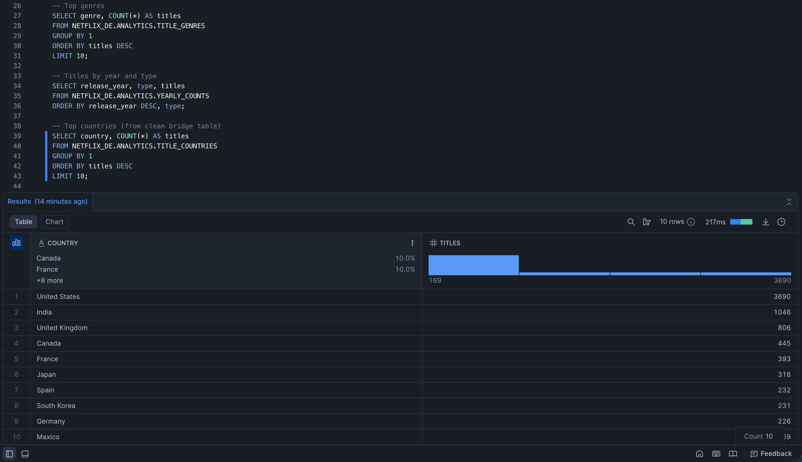

# Project Stream

This repository contains a real data engineering project built with **Snowflake + Python**, demonstrating a complete pipeline from raw data ingestion to analytics and data quality verification.

---

## 👾 Author

Aayush Keshari

---

## 🚀 Overview

This pipeline ingests a real dataset of Netflix titles, loads it into Snowflake, performs cleaning and transformation, and builds analytics tables. It also includes automated data quality checks to ensure correctness and integrity at each stage.

---

## 🧩 Architecture
Raw CSV Dataset
↓ (Python ingestion + validation)
Snowflake Internal Stage
↓ (COPY INTO)
RAW Table (Netflixed Titles)
↓ (SQL transforms)
Analytics Tables

├── TITLES_CLEAN

├── TITLE_GENRES

├── TITLE_COUNTRIES

└── YEARLY_COUNTS

↓ (Quality checks)
Automated Data Validations

---

## 📌 Key Components

### 📥 Data Ingestion
- Downloads a real Netflix titles dataset.
- Stores it locally under `data/raw/`.
- Designed to be re-runnable without duplicating data.

### 📤 Loading to Snowflake
- Uses Snowflake internal staging.
- Loads data efficiently via `PUT` and `COPY INTO`.

### 🛠 Transformations
- Cleans raw data into analytics-ready format.
- Normalizes multi-valued fields (genres, countries) into bridge tables.
- Builds aggregated KPIs such as titles by year and type.

### ✅ Data Quality Checks
Automated checks validate:
- RAW and analytics tables are non-empty
- Rowcount consistency between RAW and clean tables
- No NULL or duplicate primary identifiers (`show_id`)
- Valid domain values (`Movie` / `TV Show`)
- Reasonable `release_year` values
- No blank values in normalized bridge tables

If all checks pass, the pipeline has executed successfully end-to-end.

---

## 📦 How to Run

### 0) Prerequisites
- Python **3.10+**
- A Snowflake account (free trial works)

---

### 1) Clone the repository
Run this from a directory such as `~/Documents`:

```bash
git clone https://github.com/aayushkeshari/project-stream.git
cd project-stream
```

### 2) Create and activate a virtual environment

```bash
python3 -m venv .venv
source .venv/bin/activate
```
(You should see (.venv) in your terminal prompt.)

### 3) Install dependencies
```bash
pip install -r requirements.txt
```

Sanity check:
```bash
python -c "from dotenv import load_dotenv; print('dotenv OK')"
```

### 4) Configure Snowflake credentials

Copy the template and fill in your credentials:

```bash
cp .env.example .env
```
Edit .env:
```bash
SNOWFLAKE_ACCOUNT=<account_locator.region>   # e.g. mhc83493.us-east-1
SNOWFLAKE_USER=<your_username>
SNOWFLAKE_PASSWORD=<your_password>
SNOWFLAKE_ROLE=ACCOUNTADMIN
SNOWFLAKE_WAREHOUSE=DE_WH
SNOWFLAKE_DATABASE=NETFLIX_DE
```

### 5) One-time Snowflake setup (SQL)

In the Snowflake Web UI → Worksheets, run:

```sql
CREATE WAREHOUSE IF NOT EXISTS DE_WH
  WAREHOUSE_SIZE='XSMALL'
  AUTO_SUSPEND=60
  AUTO_RESUME=TRUE;

CREATE DATABASE IF NOT EXISTS NETFLIX_DE;
CREATE SCHEMA IF NOT EXISTS NETFLIX_DE.RAW;
CREATE SCHEMA IF NOT EXISTS NETFLIX_DE.ANALYTICS;

CREATE OR REPLACE FILE FORMAT NETFLIX_DE.RAW.CSV_FF
  TYPE = CSV
  FIELD_OPTIONALLY_ENCLOSED_BY = '"'
  SKIP_HEADER = 1
  NULL_IF = ('', 'NULL', 'null');

CREATE OR REPLACE STAGE NETFLIX_DE.RAW.NETFLIX_STAGE
  FILE_FORMAT = NETFLIX_DE.RAW.CSV_FF;
```

### 6) Download the dataset

```bash
python ingestion/download_dataset.py
```

### 7) Run the pipeline (load + transforms)

```bash
python ingestion/load_to_snowflake.py
```

Expected output:
```bash
RAW rowcount: 8807
TITLES_CLEAN rowcount: 8807
```

### 8) Run data quality checks

```bash
python quality_checks/run_checks.py
```

Expected ending:

🎉 All data quality checks passed.

---

## 📌 Showcase Queries

These can be run in Snowflake to explore results:

```sql
-- Top genres by number of titles
SELECT genre, COUNT(*) AS titles
FROM NETFLIX_DE.ANALYTICS.TITLE_GENRES
GROUP BY 1
ORDER BY titles DESC
LIMIT 10;

-- Titles by year and type
SELECT release_year, type, titles
FROM NETFLIX_DE.ANALYTICS.YEARLY_COUNTS
ORDER BY release_year DESC, type;

-- Most common countries
SELECT country, COUNT(*) AS titles
FROM NETFLIX_DE.ANALYTICS.TITLE_COUNTRIES
GROUP BY 1
ORDER BY titles DESC
LIMIT 10;
```
---

## 📊 Example Results

Below is an example output from the analytics layer, showing the **top countries by number of Netflix titles**, generated from the normalized `TITLE_COUNTRIES` bridge table.



This result demonstrates:
- Successful normalization of multi-valued country fields
- Correct aggregation across titles
- Clean, analytics-ready Snowflake tables
